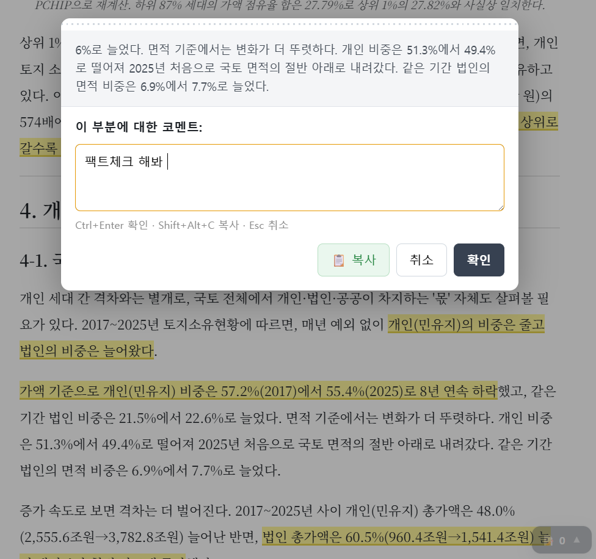

# Markdown Annotator

마크다운 프리뷰에서 텍스트를 드래그한 뒤 옆에 뜨는 버튼으로 인라인 코멘트를 남기거나 형광펜으로 표시하고, 모아서 AI 에이전트용 프롬프트로 클립보드에 복사하는 VSCode 확장입니다.



## 사용법

1. 마크다운 파일을 열고 프리뷰(`Ctrl+K V`)를 엽니다.
2. 본문에서 텍스트를 드래그하면 선택 옆에 `💬`(코멘트)와 `🖍`(형광펜) 두 개의 작은 버튼이 뜹니다
   (드래그만으로는 아무 것도 뜨지 않으므로, 복사 등 다른 목적의 선택을 방해하지 않습니다).
   - `💬`를 누르면 입력창이 열려 코멘트를 남길 수 있습니다. 본문에 표시된 코멘트를 클릭하면 수정/삭제할 수 있습니다.
   - `🖍`를 누르면 해당 부분에 노란 형광펜이 즉시 칠해집니다. 칠해진 부분을 클릭하면 메모 입력창이 열려, 그 형광펜에 대한 메모를 남기거나 수정·삭제할 수 있습니다(형광펜 자체는 별도 삭제 확인 없이 메모창의 "삭제" 버튼으로 지웁니다). 메모를 남긴 형광펜은 오른쪽 위에 작은 점으로 표시됩니다.
3. 우측 하단 패널에서 코멘트 목록을 확인하고, 개별/전체 삭제나 복사가 가능합니다. 목록의 코멘트를 클릭하면 본문의 해당 위치로 스크롤 이동하며 노란색으로 잠깐 깜빡여 표시됩니다(본문에서 위치를 찾지 못한 코멘트는 안내 토스트가 뜹니다). 패널은 접으면 아이콘과 건수만 남고, 펼쳐야 "코멘트 복사" 버튼이 나타납니다.
4. "코멘트 복사" 버튼을 누르면 AI 에이전트에 바로 붙여넣을 수 있는 프롬프트 형식으로 클립보드에 복사됩니다.

코멘트와 형광펜은 브라우저(웹뷰) `localStorage`에 파일 경로별로 각각 저장되어, 프리뷰를 닫았다 열어도 유지됩니다.

### "코멘트 복사" 결과 예시

"코멘트 복사" 버튼을 누르면 아래처럼 AI 에이전트에 그대로 붙여넣을 수 있는 형식으로 클립보드에 복사됩니다.

```
파일: d:/Documents/report.md

[검토대상 1]
- 위치: L42
- 본문: "누적점유율 곡선이 상위로 갈수록 가파르게 휘는 탓에 최상위 구간의 집중도가 과소추정되는 문제가 있었다"
- 코멘트: 팩트체크 해봐

[검토대상 2]
- 위치: L58
- 본문: "법인 총가액은 60.5%(960.4조원→1,541.4조원) 늘어난 반면"
- 코멘트: 이 수치 출처 확인 필요
```

## 설치

```
pnpm run package
```

생성된 `.vsix` 파일을 VSCode에서 `Ctrl+Shift+P` → `Extensions: Install from VSIX...`로 설치합니다.

## 업데이트

`media/review-notes.js` 등을 수정한 뒤 실제 확장에 반영하려면 다시 패키징하고 재설치해야 합니다.

```
pnpm run release
```

`release` 는 패키징(`pnpm run package`)과 설치(`pnpm run install-ext`)를 이어서 실행합니다.
`vsce` 는 `pnpm dlx` 로 그때그때 받아 쓰므로 따로 설치할 의존성은 없습니다.

재설치 후에는 열려 있던 마크다운 프리뷰를 닫았다가 다시 열어야 새 스크립트가 적용됩니다.
